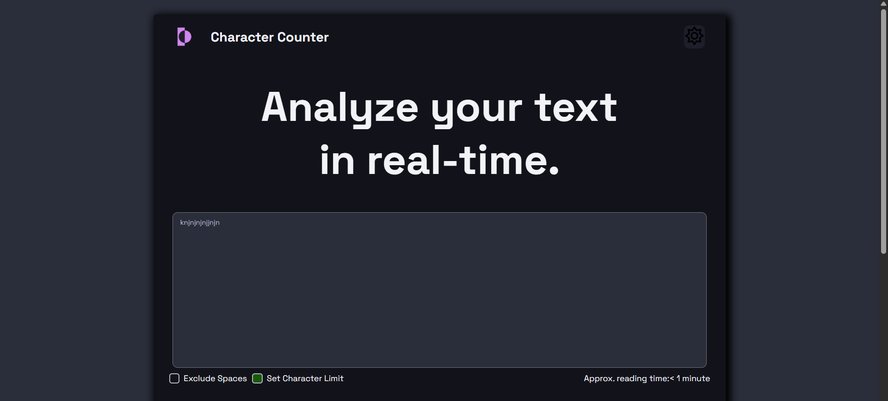
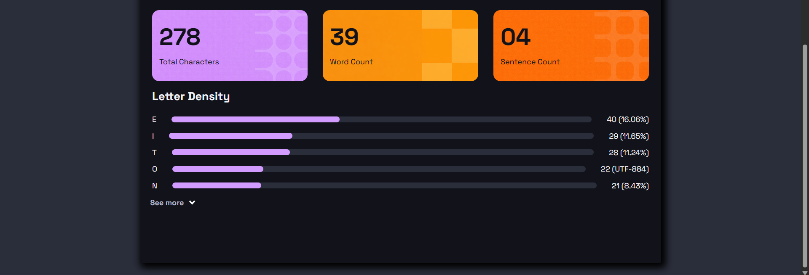
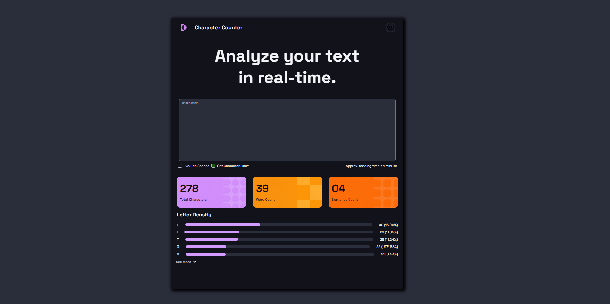

# Character Counter

## Objetivo del Proyecto

El objetivo del proyecto fue desarrollar, utilizando HTML y CSS, una interfaz web inspirada en un diseño de referencia entregado. El diseño debía verse lo más parecido posible, respetando ciertos puntos:

- Distribución visual.
- Espaciados.
- Colores.
- Tipografía.
- Bordes redondeados.
- Tarjetas de estadísticas.
- Jerarquía visual del contenido.

El enfoque principal estuvo en la maquetación y el diseño visual, ya que en este proyecto no debíamos darle funcionalidad al mismo.

## Tecnologías Utilizadas

- HTML5
- CSS3

## Organización del HTML

La estructura HTML se organizó utilizando etiquetas semánticas para mejorar la legibilidad y el mantenimiento del código.

### Head

Linkeamos nuestro `style.css`, le damos título a nuestra página y agregamos el logo que figurará en internet.

### Container

El main principal donde engloba todo el contenido y nos permitirá estilizar solo el componente.

### Header

Contiene el título del proyecto, el logo de la página y el botón de cambio de tema (dark/light mode).

### Hero

Título principal y el área de texto.

### Controls

Checkboxes e información de lectura.

### Cards

Las tarjetas con las estadísticas principales.

### Letter

Muestran un subtítulo y las barras de progreso junto con su información.

### More

Botón para visualizar más información.

## Organización del CSS

Utilicé variables donde definí colores globales dentro de `:root` para trabajar en base a la paleta de colores dada.

### Reseteo de estilos

Utilicé un selector universal (`*`) para eliminar los márgenes y padding que vienen por defecto. Además, linkeé la fuente Space Grotesk mediante `@font-face`.

### Contenedor principal

Todo el contenido de mi proyecto está dentro de un main principal, del cual me encargué de centrarlo, agregarle un tamaño con el cual voy a trabajar durante todo mi estilado, agregarle fondo, bordes redondeados y una sombra para que resalte más.

### Header

Para organizar el logo y el ícono del sol utilicé Flexbox. Esto me permitió ubicarlos fácilmente en los extremos del encabezado. También agregué un efecto hover al ícono para que la interfaz se sintiera más interactiva.

### Hero

El título fue centrado y se le dio un tamaño grande para que fuera el elemento más llamativo de la página. Abajo coloqué el área de texto, ocupando casi todo el ancho disponible para adaptarlo al maquetado de referencia.

### Controls

Utilizando Flexbox para distribuirlos uno al lado del otro, eliminando los efectos de los checkboxes por defecto, personalicé algunos de ellos.

### Cards

Utilicé Grid para poder posicionar y estructurar de manera simétrica las tarjetas de estadísticas, agregando imágenes de fondo y personalizando su color y tamaño de fuente.

### Letter

Personalicé la apariencia de las barras de progreso creadas con `<meter>`, ya que tuve que eliminar las que vienen por defecto para crear unas nuevas y estilarlas en base a mi referencia.

### Botón "See More"

Se estiló utilizando Flexbox, cambiándole el tamaño a la imagen y agregándole efectos hover.

## Dificultades Encontradas

- Sin lugar a dudas, fue el estilado del elemento `<meter>`, ya que tuve que investigar mucho sobre cómo poder eliminar el estilo de la barra de progreso que ya viene por defecto y cómo crear uno nuevo sin perder el porcentaje de mi barra.
- También me resultó complicado estilizar los checkboxes, ya que nunca antes lo había visto y tuve que investigar cómo se estructuraban y cómo eliminar los efectos predeterminados.

## Capturas del Resultado Final

### Vista principal

### Tarjetas de estadísticas

### Vista completa

